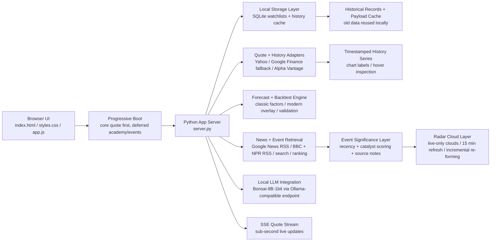

# Financial Board

Full-stack dark financial dashboard with:

- functional Python backend and browser frontend
- support for US symbols plus exchange-suffixed markets like NSE (`.NS`), BSE (`.BO`), ASX (`.AX`), JPX (`.T`), and more
- live quote, history, market-pulse, and headline fetching with offline fallback
- multi-region macro + markets framing with US and India as the first supported regions
- bond-market-first regional analysis covering yields, inflation, policy, events, equity context, and watchlist implications
- explainable multi-factor forecasting and walk-forward validation
- saved watchlists persisted in SQLite
- a learning tab that explains what the signals mean

## Stack

- `server.py`: threaded Python HTTP server, JSON API, SQLite watchlist storage, market data adapters, forecast engine
- `index.html`, `styles.css`, `app.js`: dashboard client
- `financial_board.db`: created automatically on first run, now stores saved watchlists and local historical-price cache entries
- `data/universes/`: synced index and exchange membership files
- `data/relations/`: precomputed stock relation graphs built from cached history
- `data/company_networks.json`: local company/entity relationship hints for deeper market maps
- `data/factors/`: factor cadence and update-significance datasets
- `data/papers/`: local paper registry for research-backed factor and graph design
- `vault/market-map/`: Obsidian-friendly markdown vault generated from universes, relation graphs, papers, and playbooks
- `config.json`: created automatically when you save provider settings
- local LLM features are pinned to `Bonsai-8B-1bit` through the Ollama-compatible endpoint
- `kb/`: durable local knowledge base for macro, region, sector, company, and playbook notes

## Technical Summary

This platform is built as a lightweight full-stack app with a browser client and a Python server:

- the frontend is a static single-page dashboard built with plain `HTML`, `CSS`, and modular `JavaScript`
- the backend is a threaded Python HTTP server that serves the UI, normalizes ticker symbols, fetches market/news data, computes forecasts, and exposes JSON APIs
- market data is pulled server-side from layered providers, then normalized into one response shape for the UI
- multi-region payloads are built from region configs and adapter-style helper functions so new regions can be added without rewriting the dashboard
- historical price series are cached locally in SQLite so previously viewed symbols load faster on later visits
- normalized historical records are also stored locally in SQLite so old data can be reused by charts, macro analysis, and relation graphs without repeated refetches
- regional bond, inflation, events, and calendar payloads are also cached locally with TTLs and stale-safe fallback so older context is reused instead of being refetched on every dashboard load
- live quote updates are pushed to the UI through server-sent events
- forecasting and model-lab outputs are computed on the backend so the browser stays fast and thin
- the client now renders in stages, so the active quote and overview paint first while slower Academy and event explainers fill in afterward
- first load is optimized so the dashboard request starts immediately, while presets, settings, saved lists, and deeper explainers stream in after the first useful paint
- the browser now hits a lightweight overview endpoint first, so watchlist quotes and the active overview can paint before the heavier full dashboard finishes
- Academy and Research now degrade gracefully: they show market-structure-first content immediately, use shorter local-LLM time budgets, and fall back to web-grounded or rules-based answers when the LLM is slow
- event flow is now timestamp-aware and significance-ranked, so important recent and prior events remain visible with source and publish time
- market radar has its own refresh path and now auto-refreshes every 15 minutes without waiting for the full dashboard refresh
- market radar surfaces floating event clouds only from live news items, with in-place expansion on click, a hide/show glass toggle, and fresh-item re-formation when more important stories arrive
- market radar now blends live event headlines with macro pulse and active-ticker micro context, so the section reflects both top-down and stock-specific pressure
- the dashboard now keeps a region-selected macro layer for bonds, inflation, policy, events, equity context, watchlist implications, and US-vs-India comparison
- universe sync, historical backfill, and relation-graph generation are now explicit scripts so large-market datasets can be refreshed deterministically
- the top watch overview can be compacted away with a user toggle, and radar clouds can be popped together so the panel shrinks upward when you want a denser layout
- news retrieval now blends Google News RSS with popular publisher RSS feeds like BBC and NPR, then dedupes and ranks them server-side
- large charts now carry timestamp-aware history series, axis labels, and hover inspection instead of only raw close arrays
- local-LLM features are pinned to `Bonsai-8B-1bit`, even if another model name is saved in config, to keep inference lighter and more predictable

## Architecture



## Run

```bash
python3 server.py
```

Then open [http://127.0.0.1:8000](http://127.0.0.1:8000).

## Test

```bash
python3 -m unittest discover -s tests -v
```

The current suite covers:

- backend history caching and fallback behavior
- dashboard assembly and model-lab payload shape
- timestamped and significance-ranked event feed responses
- multi-source RSS aggregation for event and radar feeds
- local LLM config pinning to `Bonsai-8B-1bit`
- historical-record persistence and relation-graph wiring
- recommendation and backtest regression checks
- frontend HTML and JavaScript contract checks for the main dashboard panels and tabs

## What is functional now

- add/search tickers globally from the UI
- quick-load presets for NASDAQ, S&P 500 leaders, NSE leaders, and macro baskets
- fetch quotes and historical charts from backend market adapters
- cache previously fetched historical series locally so already-viewed tickers load faster on later visits
- show urgent market banner headlines on the main screen
- render timestamp-aware charts with X/Y axes and hoverable value/date inspection
- compute explainable forecast direction, confidence, fair-value gap, and factor attribution
- compare classic quant signals with a modern overlay and surface whether both agree or diverge
- run scenario tests with walk-forward validation, hit-rate, and error metrics
- teach the active ticker through classic quant formulas such as momentum, z-score, volatility, volume ratio, beta, valuation, and drawdown inside Academy
- enrich Academy with ticker-specific explainers grounded on live market state plus web search results and optional local-LLM summarization
- rank and timestamp event flow items so major catalysts remain visible with source, publish time, and impact score
- highlight major active-ticker catalyst regimes visually when event pressure is elevated
- blend popular RSS feeds into radar and event flow so the news layer updates with broader publisher coverage
- save and reload watchlists through SQLite
- compare US and India using bond-first macro tabs, calendars, and watchlist implication flows
- label fact vs interpretation in the macro workflow so decision support stays transparent

## Coverage notes

- US tickers work directly, for example `AAPL`, `MSFT`, `NVDA`
- NSE tickers can be entered as `RELIANCE` with market set to `NSE`, or directly as `RELIANCE.NS`
- The same suffix pattern works for several other exchanges through the market selector

## Provider model

Default mode is a Yahoo-style no-key fallback for broad symbol coverage.
You can optionally save an Alpha Vantage API key in the settings dialog and switch the backend to `alpha_vantage` for additional enrichment where available.

Historical-price loading now uses a layered path:

- Yahoo chart API when available
- Google Finance page timeline extraction as fallback
- local SQLite history cache for already-tracked symbols
- local SQLite historical-record storage for durable series reuse
- SQLite payload cache for regional macro/event/calendar context with TTL-based refresh

## Market graph pipeline

The repo now supports a simple durable pipeline for large stock universes:

```bash
python3 scripts/sync_universes.py
python3 scripts/backfill_history.py --universe sensex30 --range 1Y
python3 scripts/backfill_history.py --universe sp500 --range 1Y
python3 scripts/backfill_history.py --universe nasdaq_listed --range 1Y --limit 250
python3 scripts/build_relations.py --universe sensex30
python3 scripts/build_relations.py --universe sp500
python3 scripts/build_relations.py --universe nasdaq_listed --limit 250
```

Or run the orchestrator:

```bash
python3 scripts/prepare_market_graph.py --nasdaq-limit 250
```

Why this shape:

- universes are stored as plain JSON manifests
- historical records are cached once and reused
- relation graphs are generated from cached history plus sector structure
- company/entity relationship nodes can be layered on top of stock graphs for deeper context
- the dashboard can consume those precomputed relations without refetching the past

The relation layer is inspired by:

- [Temporal Relational Ranking for Stock Prediction](https://arxiv.org/abs/1809.09441)
- [HIST: A Graph-based Framework for Stock Trend Forecasting via Mining Concept-Oriented Shared Information](https://arxiv.org/abs/2110.13716)
- [Chronos](https://arxiv.org/abs/2403.07815)
- [TimesFM](https://arxiv.org/abs/2310.10688)

## Obsidian-style market map

The repo now supports a local markdown vault in:

- `vault/market-map/Market Graph Index.md`
- `vault/market-map/companies/`
- `vault/market-map/sectors/`
- `vault/market-map/papers/`
- `vault/market-map/playbooks/`

Build it with:

```bash
python3 scripts/build_market_map_vault.py
```

This follows the same simple pattern:

- store facts as local files
- keep derived structure explicit
- use markdown + links for durable memory
- let the dashboard read local notes instead of hiding context in runtime code

This project keeps provider calls on the server side so:

- secrets are not exposed in frontend code
- cross-origin limitations stay off the client
- provider-specific normalization is centralized

## API endpoints

- `GET /api/health`
- `GET /api/config`
- `POST /api/config`
- `GET /api/academy?symbol=ICICIBANK.NS`
- `GET /api/events?category=world&symbol=ICICIBANK.NS`
- `GET /api/overview?symbols=ICICIBANK.NS,AAPL&active=AAPL`
- `GET /api/presets`
- regional macro, inflation, policy, calendar, and comparison payloads are returned inside `POST /api/dashboard`
- `GET /api/search?q=AAPL`
- `GET /api/watchlists`
- `POST /api/watchlists`
- `POST /api/dashboard`
- `POST /api/lab`

## Validation and limitation

This is a decision-support dashboard, not personalized investment advice.
The forecasting logic is research-inspired and explainable, but it is still heuristic and should be treated as an analytical aid rather than an execution model.
